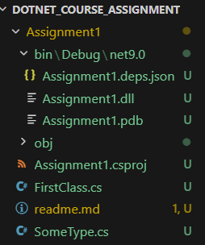
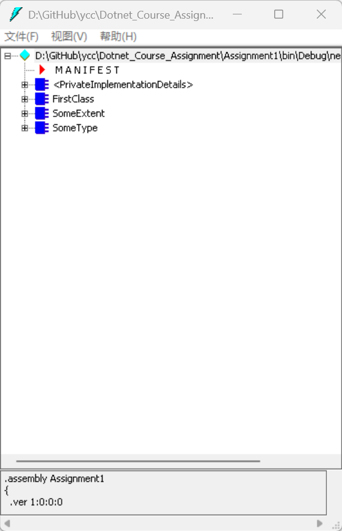
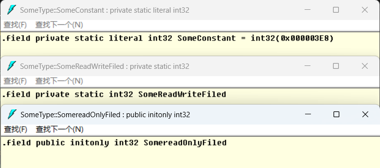
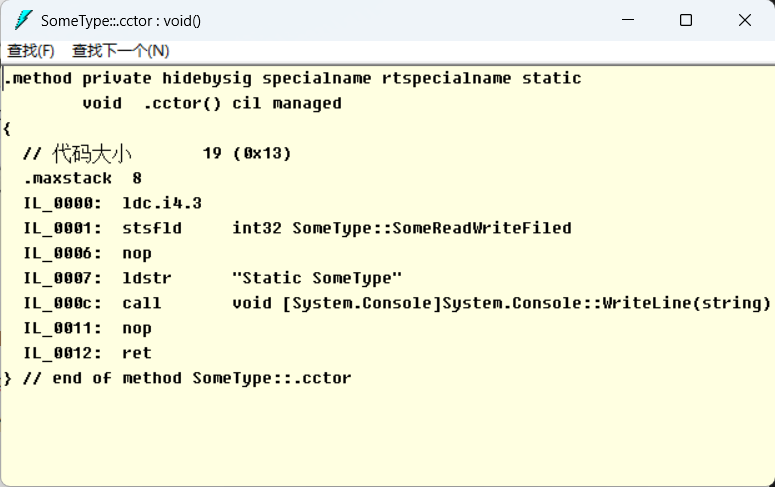
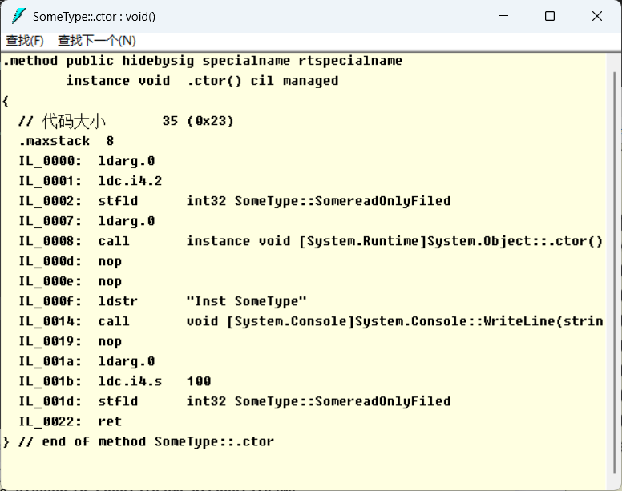
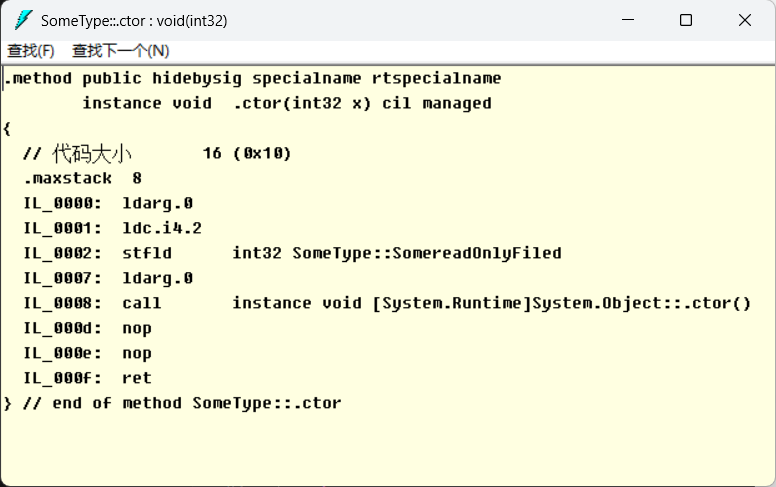

# 第一次课程作业

作业内容：使用 ildasm 工具查看生成的结果

## 测试环境（Windows）

本作业在 **Windows** 下编译并用 ildasm 查看 IL，环境如下。

| 项目         | 说明       |
| ------------ | ---------- |
| **操作系统** | Windows 11 |
| **.NET SDK** | 9.0.301    |
| **目标框架** | `net9.0`   |

在其它机器上复现时，请至少保证已安装与项目兼容的 **.NET 9 SDK**，并具备可打开 `Assignment1.dll` 的 **ildasm**（或课程允许的等价工具）。

---

## 0 编译代码并查看结果

进入项目目录并编译代码

```bash
cd Assignment1
dotnet build
```

编译结果保存在目录 `Assignment1\bin\Debug\net9.0\Assignment1.dll` 中



在 Windows 搜索框输入并打开 **Developer Command Prompt for VS**（或已加入 PATH 的终端），输入 **`ildasm`**，打开工具，通过 **文件 → 打开** 加载上述 `Assignment1.dll`，即可在树形结构中展开命名空间与类型查看 IL。



---

## 1 常数和字段的区别

对应代码：

```csharp
//(3)常数
const Int32 SomeConstant = 1000;
//(4)只读
public readonly Int32 SomereadOnlyFiled = 2;
//(5)静态
static Int32 SomeReadWriteFiled = 3;
```

在 ildasm 中展开 `SomeType`，在 **Fields** 下可看到三条字段声明（与下图对应）。



### 在 IL 元数据中的典型形态（可与 ildasm 中 “显示” 的文本对照）

| 源码                                          | IL 字段声明中的关键特征                                            | 含义简述                                                                                                                     |
| --------------------------------------------- | ------------------------------------------------------------------ | ---------------------------------------------------------------------------------------------------------------------------- |
| `const Int32 SomeConstant = 1000`             | `static literal`，并带有编译期常量值（如 `int32(0x3e8)`，即 1000） | **编译期常数**：元数据中保留名称与值；引用处常被编译器直接替换为 `ldc.i4` 等指令，运行时不会像普通字段那样再“读一次内存槽”。 |
| `public readonly Int32 SomereadOnlyFiled = 2` | 实例字段 + **`initonly`**                                          | **运行时只读字段**：每个实例各自一份；赋值只能在实例构造器（或字段初始化器对应的构造阶段）完成，之后不可修改。               |
| `static Int32 SomeReadWriteFiled = 3`         | **`static`**，无 `literal`、无 `initonly`                          | **类型级静态字段**：由该类型的所有实例共享；可在静态构造器或任意静态成员中按权限读写（本示例为 `private`）。                 |

### 对比小结

1. **语义**：`const` 是编译期常量；`readonly` 是实例创建时确定、之后不可改的字段；普通 `static` 字段属于类型，可在运行期多次赋值（只要可见性与逻辑允许）。
2. **存储与使用**：常数多以 `literal` 形式固定在元数据中；后两者在运行期对应实际的字段槽，`readonly` 按实例分配，`static` 按类型分配。
3. **与构造器的关系**：`readonly` 的再赋值通常出现在 `.ctor` 中（本作业 `SomeType()` 里将 `SomereadOnlyFiled` 设为 100）；静态字段的初始化逻辑常出现在 `.cctor` 或字段初始化器生成的代码中。

---

## 2 类型构造器的查看

对应代码：

```csharp
//(6)类型构造器
static SomeType()
{
    Console.WriteLine("Static SomeType");
}
```

在 ildasm 中展开 `SomeType`，可以看到名为 **`.cctor`** 的方法（CLI 中类型构造器的专用名称）。



### 说明

- **名称与约定**：类型构造器在 IL 中固定为 **`.cctor`**（class constructor），标记为 `specialname`、`rtspecialname`，返回类型为 `void`，无参数。
- **调用时机**：由 CLR 在**首次使用该类之前**触发（例如首次访问静态成员、首次创建实例等，具体触发点由 CLR 规范约束），且保证**每个类型初始化只执行一次**（在单 AppDomain 前提下由运行时保证线程安全语义）。
- **职责**：用于初始化**静态状态**（本例中调用 `Console.WriteLine` 仅为观察执行顺序；静态字段 `SomeReadWriteFiled` 的初值若由编译器生成初始化代码，也可能出现在 `.cctor` 或内联策略相关代码中，以 ildasm 实际显示为准）。
- **与实例构造器的区别**：`.cctor` 无 `this` 参数，不创建对象；实例构造器为 **`.ctor`**，在 `new` 时执行并接收可能存在的参数。

---

## 3 实例构造器的查看

对应代码：

```csharp
//(7)实例构造
public SomeType()
{
    Console.WriteLine("Inst SomeType");
    SomereadOnlyFiled = 100;
}
public SomeType(Int32 x)
{ }
```

在 ildasm 的 `SomeType` 下可看到两个实例构造器，IL 名称均为 **`.ctor`**，通过**方法签名**区分：无参版本与带一个 `int32` 参数的版本。





### 说明

- **命名**：实例构造器在 IL 中均为 **`.ctor`**，与静态的 **`.cctor`** 不同；重载靠参数列表区分（本例为 `void .ctor()` 与 `void .ctor(int32)`）。
- **无参 `.ctor`**：通常包含：调用基类实例构造器（`call instance void [mscorlib]System.Object::.ctor()` 或等价形式）、执行 `Console.WriteLine`、对 **`initonly` 字段 `SomereadOnlyFiled` 赋值**（仅允许在构造器阶段完成）等指令序列。
- **带参 `.ctor`**：本例方法体为空，但仍需满足语言规则（例如隐式链式调用基类构造器），ildasm 中可能仍可见对 `object::.ctor` 的调用，以实际 IL 为准。
- **与 `.cctor` 的执行顺序**：一般先完成类型初始化（必要时执行 `.cctor`），再在 `new SomeType()` 时执行对应 **`.ctor`**。

### 与第 2 节对照

| 项目     | 类型构造器                 | 实例构造器                          |
| -------- | -------------------------- | ----------------------------------- |
| IL 名称  | `.cctor`                   | `.ctor`                             |
| 典型用途 | 静态成员、静态字段的初始化 | 初始化实例状态、`readonly` 字段赋值 |
| 调用     | 类型首次使用前由 CLR 触发  | `new` 或显式 `base`/`this` 构造器链 |

---

## 结论

通过 ildasm 查看 `Assignment1.dll` 中的 `SomeType`，可以明确：**常数以 `literal` 形式固化在元数据中**；**只读实例字段以 `initonly` 标识**；**普通静态字段为类型级可写字段**。类型级初始化对应 **`.cctor`**，对象创建对应一个或多个重载的 **`.ctor`**，二者名称与调用时机均不同，这与 C# 源码中的 `static SomeType()` 与 `public SomeType(...)` 一一对应。
